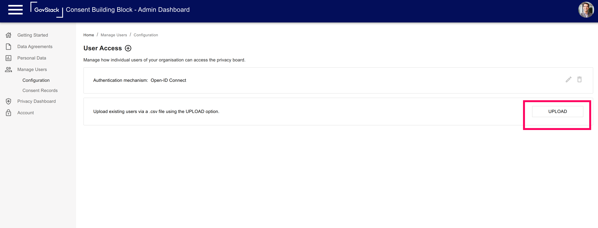
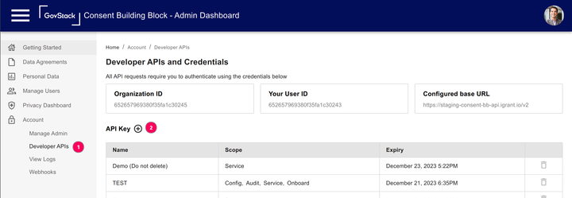
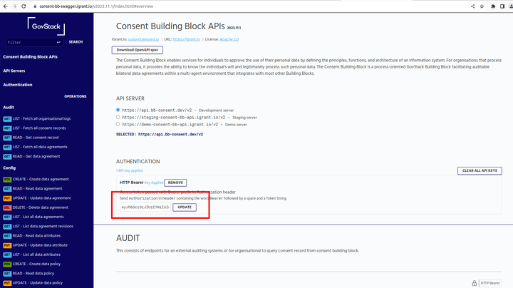

# Consent BB onboarding instruction 

## Create Data agreement 

## Create individuals
You can onboard individual by uploading a [CSV file](./consent/individuals.csv) or executing this [endpoint](https://consent-bb-swagger.igrant.io/v2023.11.1/index.html#post-/config/individual)

### Recover your account for changing individual password

visit https://yopmail.com/en/

## Obtain an API key

Now you have set up Admin dashboard (for administrators) and Privacy dashboard (for individuals)

For the API integrations towards an application you need to obtain an API key:

## Set header token

