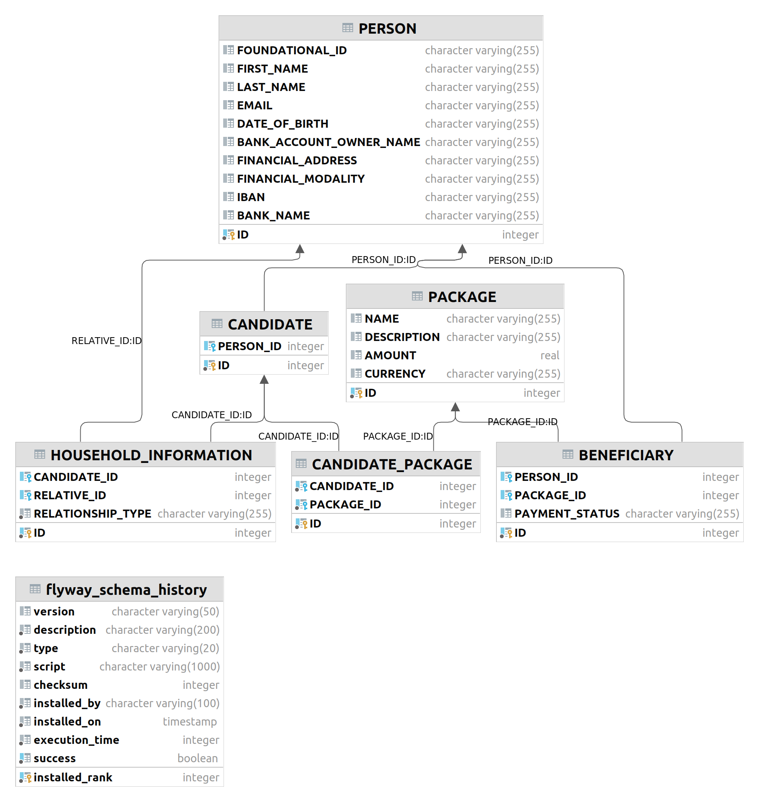

# USCT: Data Model

This document describes the database model of the USCT.

## Entity-Relationship Diagram

The data model is described in the diagram.

## Beneficiaries
| Name                          |          Type          | Modifiers |           Description            |
|:------------------------------|:----------------------:|:----------|:--------------------------------:|
| id [PK]                       |        integer         | NOT NULL  |           Primary key            |
| person_id [FK]                |        integer         | NOT NULL  |    foundational id forign key    |
| package_id    [FK]            |        integer         | NOT NULL  |      Package id forign key       |
| payment_status                | character varying(255) | NOT NULL  |   [Payment status](status.md)    |
| functional_id                 | character varying(255) | NOT NULL  | Functional id of the beneficiary |
| payment_onboarding_status     | character varying(255) | NOT NULL  |    Onboarding request status.    |
| payment_onboarding_request_id | character varying(255) | NOT NULL  |      Onboarding request id.      |

## Candidates

| Name             |  Type   | Modifiers | Description |
|:-----------------|:-------:|:----------|:-----------:|
| id [PK]          | integer | NOT NULL  | Primary key |
| person_id   [FK] | integer |           |             |

## Candidate_package
| Name              |  Type   | Modifiers |       Description       |
|:------------------|:-------:|:----------|:-----------------------:|
| id [PK]           | integer | NOT NULL  |       Primary key       |
| candidate_id [FK] | integer | NOT NULL  | Candidate id forign key |
| package_id [FK]   | integer | NOT NULL  |  Package id forign key  |

## Packages
| Name        |          Type          | Modifiers                                                  | Description |
|:------------|:----------------------:|:-----------------------------------------------------------|:-----------:|
| id [PK]     |        integer         | NOT NULL                                                   | Primary key |
| name        | character varying(255) | Name of the package                                        |
| description |          text          | Description of the package can be taken fom OpenIMIS       |
| amount      |         float          | The amount of money that should be paid to the beneficiary |
| currency    | character varying(255) | The currency of the amount                                 |

## Payment Disbursement
Log of payment order request. 

| Name        |          Type          | Modifiers |                  Description                   |
|:------------|:----------------------:|:----------|:----------------------------------------------:|
| id [PK]     |         bigint         | NOT NULL  |                  Primary key                   |
| callback    | character large object |           |              Body of the callback              |
| mode        | character varying(255) |           | Payment service mode (emulator or payment hub) |
| request     | character large object |           |        Body and headers of the request         |
| requestuuid | character varying(255) |           |              UUID of the request               |
| response    | character large object |           |                 Response body                  |

## Person
Similar [description](https://openid.net/specs/openid-connect-core-1_0.html#5.1.%20Standard%20Claims).

financial_address is https://govstack.gitbook.io/bb-payments/9-service-apis#docs-internal-guid-f78d8d0a-7fff-33bf-2d15-aced73dc0f65

| Name                    |          Type          | Modifiers |                                                                       Description                                                                        |
|:------------------------|:----------------------:|:----------|:--------------------------------------------------------------------------------------------------------------------------------------------------------:|
| id [PK]                 |        integer         | NOT NULL  |                                                                       Primary key                                                                        |
| personal_id             | character varying(255) |           |                               Personal id code also known as foundational id. UUID is a temporary solution for showing it.                               |
| first_name              | character varying(255) |           |                                                                   Person's first name                                                                    |
| last_name               | character varying(255) |           |                                                                    Person's last name                                                                    |
| email                   | character varying(255) |           |                                                                      Person's email                                                                      |
| date_of_birth           | character varying(255) |           |                                                                  Person's date of birth                                                                  |
| region                  | character varying(255) |           |                                                               Person's region or district                                                                |
| home_address            | character varying(255) |           |                                                                  Person's home address                                                                   |
| phone_number            | character varying(255) |           |                                                                  Person's phone number                                                                   |
| occupation              | character varying(255) |           |                                                                   Person's occupation                                                                    |
| municipality            | character varying(255) |           |                                                                  Person's municipality                                                                   |
| zip_code                | character varying(255) |           |                                                                    Person's zip code                                                                     |
| bank_account_owner_name | character varying(255) |           |     Bank Account Owner name. [More info](https://github.com/GovStackWorkingGroup/sandbox-bb-payments/tree/bad263faa7ff1c4d7788751e9cd06899c561853a)      |
| financial_address       | character varying(255) |           |         Financial address [more info](https://github.com/GovStackWorkingGroup/sandbox-bb-payments/tree/bad263faa7ff1c4d7788751e9cd06899c561853a)         |
| financial_modality      | character varying(255) |           |                                                 Financial modality [more info](./financial-modality.md)                                                  |
| iban                    | character varying(255) |           | International Bank Account Number [more info](https://github.com/GovStackWorkingGroup/sandbox-bb-payments/tree/bad263faa7ff1c4d7788751e9cd06899c561853a) |
| bank_name               | character varying(255) |           |             Bank name [more info](https://github.com/GovStackWorkingGroup/sandbox-bb-payments/tree/bad263faa7ff1c4d7788751e9cd06899c561853a)             |