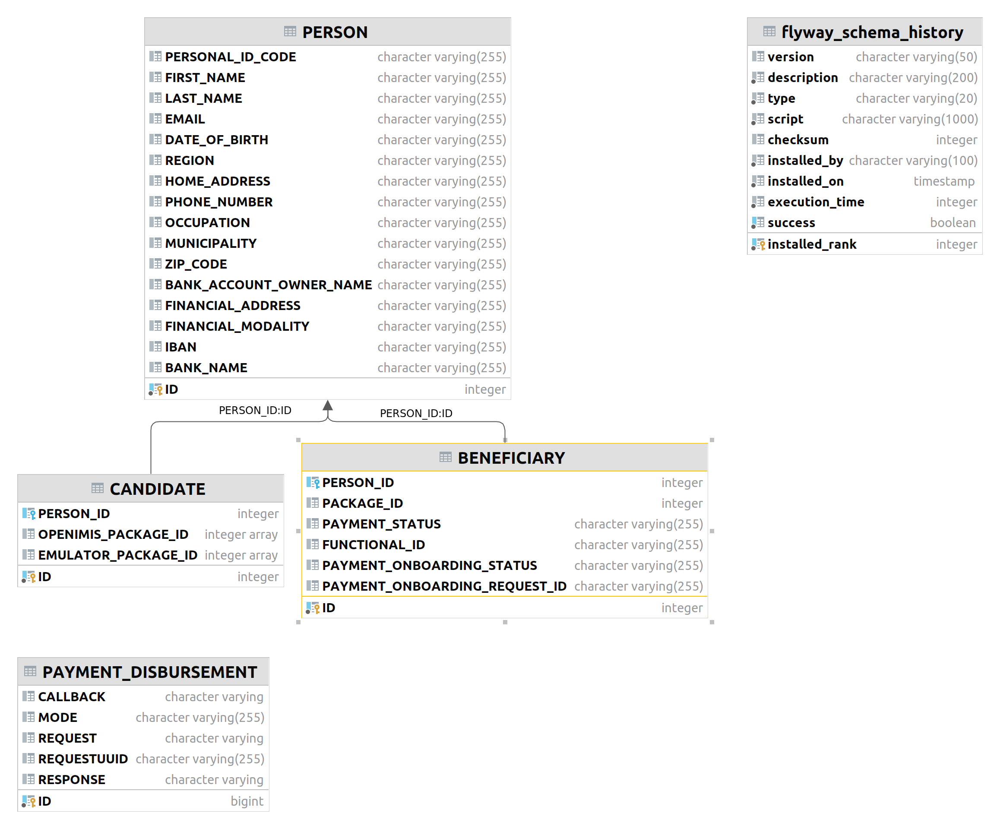

# Mock-SRIS: Data Model

This document describes the database model of the Mock-SRIS.

## Entity-Relationship Diagram

The data model is described in the diagram.

## Beneficiaries
| Name               |          Type          | Modifiers |         Description         |
|:-------------------|:----------------------:|:----------|:---------------------------:|
| id [PK]            |        integer         | NOT NULL  |         Primary key         |
| person_id [FK]     |        integer         | NOT NULL  | foundational id forign key  |
| package_id    [FK] |        integer         | NOT NULL  |    Package id forign key    |
| payment_status     | character varying(255) | NOT NULL  | [Payment status](status.md) |

## Candidates

| Name             |  Type   | Modifiers | Description |
|:-----------------|:-------:|:----------|:-----------:|
| id [PK]          | integer | NOT NULL  | Primary key |
| person_id   [FK] | integer |           |             |

## Candidate_package
| Name              |  Type   | Modifiers |       Description       |
|:------------------|:-------:|:----------|:-----------------------:|
| id [PK]           | integer | NOT NULL  |       Primary key       |
| candidate_id [FK] | integer | NOT NULL  | Candidate id forign key |
| package_id [FK]   | integer | NOT NULL  |  Package id forign key  |

## Packages
| Name        |          Type          | Modifiers                                                  | Description |
|:------------|:----------------------:|:-----------------------------------------------------------|:-----------:|
| id [PK]     |        integer         | NOT NULL                                                   | Primary key |
| name        | character varying(255) | Name of the package                                        |
| description |          text          | Description of the package can be taken fom OpenIMIS       |
| amount      |         float          | The amount of money that should be paid to the beneficiary |
| currency    | character varying(255) | The currency of the amount                                 |

## Person
Similar [description](https://openid.net/specs/openid-connect-core-1_0.html#5.1.%20Standard%20Claims).

financial_address is https://govstack.gitbook.io/bb-payments/9-service-apis#docs-internal-guid-f78d8d0a-7fff-33bf-2d15-aced73dc0f65

| Name                    |          Type          | Modifiers |                                                                        Description                                                                        |
|:------------------------|:----------------------:|:----------|:---------------------------------------------------------------------------------------------------------------------------------------------------------:|
| id [PK]                 |        integer         | NOT NULL  |                                                                        Primary key                                                                        |
| personal_id             | character varying(255) |           |                               Personal id code also known as foundational id. UUID is a temporary solution for showing it.                                |
| first_name              | character varying(255) |           |                                                                    Person's first name                                                                    |
| last_name               | character varying(255) |           |                                                                    Person's last name                                                                     |
| email                   | character varying(255) |           |                                                                      Person's email                                                                       |
| date_of_birth           | character varying(255) |           |                                                                  Person's date of birth                                                                   |
| region                  | character varying(255) |           |                                                                Person's region or district                                                                |
| home_address            | character varying(255) |           |                                                                   Person's home address                                                                   |
| phone_number            | character varying(255) |           |                                                                   Person's phone number                                                                   |
| occupation              | character varying(255) |           |                                                                    Person's occupation                                                                    |
| municipality            | character varying(255) |           |                                                                   Person's municipality                                                                   |
| zip_code                | character varying(255) |           |                                                                     Person's zip code                                                                     |
| bank_account_owner_name | character varying(255) |           |      Bank Account Owner name. [More info](https://github.com/GovStackWorkingGroup/sandbox-bb-payments/tree/bad263faa7ff1c4d7788751e9cd06899c561853a)      |
| financial_address       | character varying(255) |           |         Financial address [More info](https://github.com/GovStackWorkingGroup/sandbox-bb-payments/tree/bad263faa7ff1c4d7788751e9cd06899c561853a)          |
| financial_modality      | character varying(255) |           |         Financial modality [More info](https://github.com/GovStackWorkingGroup/sandbox-bb-payments/tree/bad263faa7ff1c4d7788751e9cd06899c561853a)         |
| iban                    | character varying(255) |           | International Bank Account Number  [More info](https://github.com/GovStackWorkingGroup/sandbox-bb-payments/tree/bad263faa7ff1c4d7788751e9cd06899c561853a) |
| bank_name               | character varying(255) |           |             Bank name  [More info](https://github.com/GovStackWorkingGroup/sandbox-bb-payments/tree/bad263faa7ff1c4d7788751e9cd06899c561853a)             |