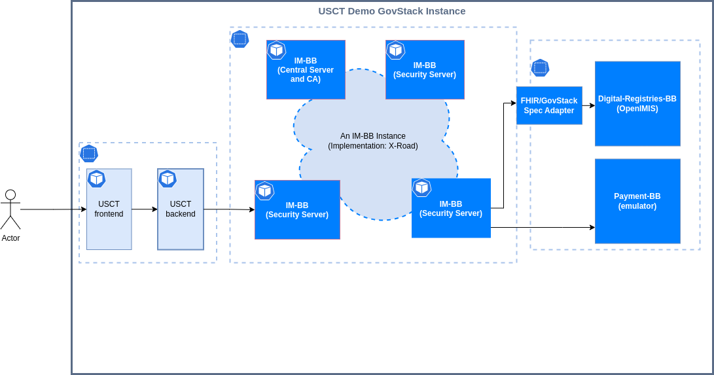

# How to deploy USCT use case to minikube 




This is minimal version of USCT with only X-Road as full-fledged BB and payment emulator.

[High overview documentation](https://govstack.gitbook.io/sandbox/access-demos/diy/usct-diy-version).

## Prerequisites 

* [minikube](https://minikube.sigs.k8s.io/docs/) or other Kubernetes cluster.
* [Helm charts](https://helm.sh/docs/topics/charts/)
* [k9s](https://k9scli.io/topics/install/) _Optional_


## Installation 
1. Apply next command

```shell
helm install usct https://gitlab.com/oleksiidn/diy-usct/-/package_files/101235864/download --create-namespace --namespace usct
```
2. Port forward UI of the Security Server 3

``` shell
kubectl port-forward \
    -n usct \
    service/sandbox-xroad-ss3 4000 4000
```

3. Navigate to 'Clients' tab and press 'Add subsystem' button. 
4. Fill 'Payment' name as Subsystem Code. 
5. Press Yes in Register client popup window. 
6. Go into new 'PAYMENT' subsystem CAPITAL CASE
7. Click on 'Services' tub. 
8. Press 'Add REST' button. 
9. Choose 'OpenAPI 3 Description' option 
10. Fill 'http://payment-bb-emulator.usct.svc.cluster.local:8080/v3/api-docs' into URL placeholder and 'api' into Service Code. 
11. Enable a new created service --> click on the related switch. 
12. Expand a new created REST definition 
13. Press 'Add subjects' in the 'Service Parameters' tab 
14. Press 'Search' button 
15. Check 'Client' and 'Provider' checkboxes and press 'Add selected' 
16. Close popup


## Uninstall 

```shell
helm uninstall usct --namespace usct
```

##  X-Road set

1. Central server
2. Security server management (for connecting to the central server)
3. Clients Security server
4. Provider Security server
