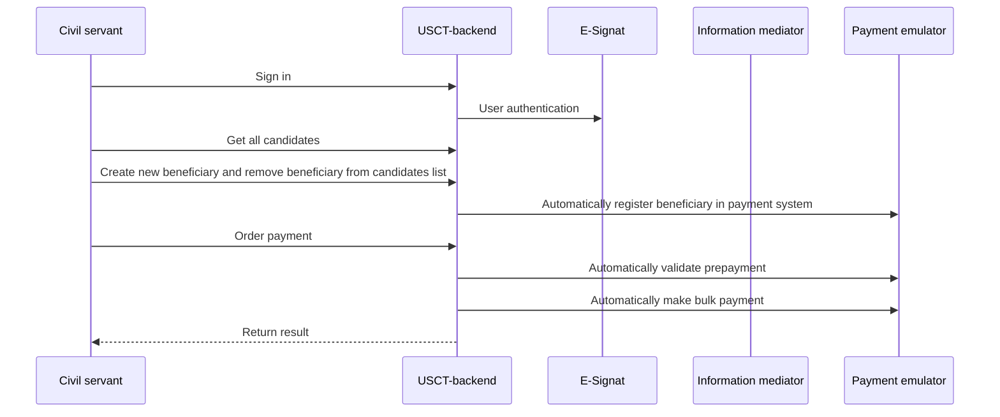

# Mock-SRIS

This is a driver backend application for
[Unconditional Social Cash Transfer](https://github.com/GovStackWorkingGroup/product-use-cases/blob/main/product-use-case/inst-1-unconditional-social-cash-transfer.md)
(USCT) use case.

[Live Demo](https://usct.dev.sandbox-playground.com/driver-poc/)

[//]: # (## Building block diagram need to update parts of the section)

[//]: # ([![]&#40;./images/bb.png&#41;]&#40;&#41; Outdated)

[//]: # ([![]&#40;./images/figma.png&#41;]&#40;https://www.figma.com/file/qVUaK5Z5FmgQV16C71RRCn/USCT---Vertical-Prototype?type=design&node-id=178-5054&#41; Outdated)

## Application logic



This implementation is blocked due to the issues mentioned in
the [ticket](https://govstack-global.atlassian.net/browse/SND-531?focusedCommentId=12851&page=com.atlassian.jira.plugin.system.issuetabpanels%3Acomment-tabpanel#comment-12851).

## Authentication / Authorization

[MOSIP e-Signt](https://docs.mosip.io/1.2.0/integrations/e-signet) uses as OpenID Connect.

### Roles and permissions

| FoundationalId | Role               | subject                              | Description                                         |
|----------------|--------------------|--------------------------------------|-----------------------------------------------------|
| 5649650687     | ENROLLMENT_OFFICER | 299950323465436931629862208523254959 | Officer responsible for enrollment                  |
| 4893724702     | PAYMENT_OFFICER    | 294629625538148508290996199782510910 | Officer responsible for payment                     |
| 2371487382     | REGISTRY_OFFICER   | 268505314334796284434550524121540566 | Officer responsible for creating/editing candidates |

### Other test users

* 7436956034
* 5879614089
* 3145283460
* 7540825162
* 9531082389
* 8917213569

## Quick start

After the installation finishes, one can access the interfaces e.g. with port forwarding.

``` shell
kubectl port-forward \
    -n mock-sris \
    service/mock-sris 8080 8080
```

Curl command:

`curl 'localhost:8080/emulator-health'`

### CI/CD

Pipeline variables:

* AWS_RESOURCE_NAME_PREFIX = mock-sris/dev-app
* AWS_CLUSTER_NAME = Kubernetes cluster name, e.g. "Govstack-sandbox-cluster-dev"
* AWS_ACCOUNT = 463471358064 (Sandbox Dev)
* AWS_ROLE = CircleCIRole
* CHART_NAMESPACE = `mock-sris`
* AWS_DEFAULT_REGION = eu-central-1

### Useful commands

```shell
helm install mock-sris ./helm/ --create-namespace --namespace mock-sris
```

```shell
helm upgrade --install mock-sris ./helm/ --create-namespace --namespace mock-sris
```

```shell
helm install --debug --dry-run mock-sris ./helm/ --create-namespace --namespace mock-sris
```

```shell
helm uninstall mock-sris --namespace mock-sris
```

### DB connection

`spring.datasource.url=jdbc:h2:file:./src/main/resources/db/data/mock-sris;AUTO_SERVER=true`

### Information mediator variables

**PAYMENT_IM_BASE_URL
** = `http://sandbox-xroad-ss2.sandbox-im.svc.cluster.local:8080/r1/SANDBOX/GOV/PROVIDER/PAYMENT/api`

**PAYMENT_IM_HEADER** = `SANDBOX/ORG/CLIENT/TEST`
