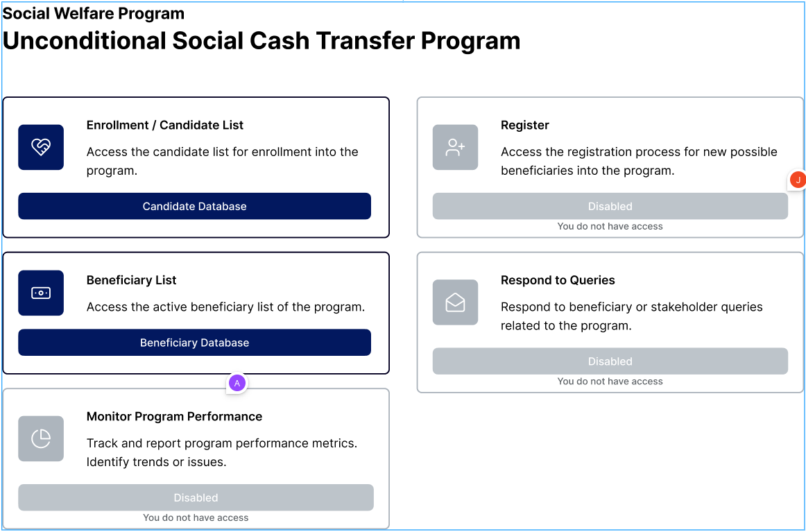
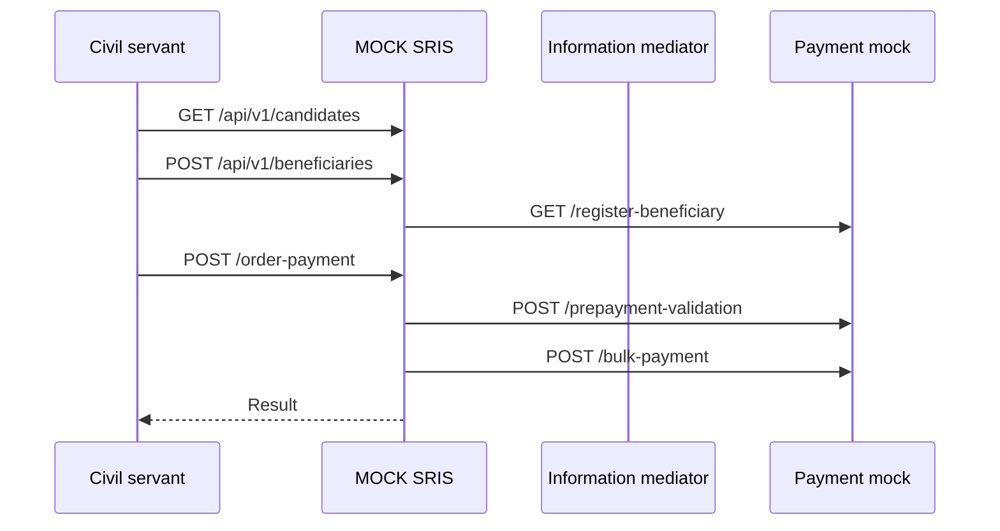

# Mock-SRIS
This is a driver backend application for 
[Unconditional Social Cash Transfer](https://github.com/GovStackWorkingGroup/product-use-cases/blob/main/product-use-case/inst-1-unconditional-social-cash-transfer.md)
(USCT) use case.

[](https://www.figma.com/file/qVUaK5Z5FmgQV16C71RRCn/USCT---Vertical-Prototype?type=design&node-id=178-5054)

## Application logic


## Foundational id

Each Government Entity will enroll beneficiaries in their Social Benefit program BB using Registration and Workflow
building blocks. A Functional ID will be generated by the Government Social Benefit Program BB. The Functional ID
(which is to be provided by the Government Social Benefit Program Beneficiary BB at the time of validating the
eligibility of the Beneficiary to be enrolled in the social benefit program)  is an identification that will be
stored in the Account-ID  Mapper in the Payments Building block to link a particular person’s foundational ID associated
with a G2P Social Benefit Program either as a Payee or as an Agent providing redemption of Voucher. The Payments BB will
need to provide API endpoints to the Government Social Benefit Program BB for populating and updating the mapper. In
order to protect privacy of beneficiaries, the data stored in the Account-Account Mapper will be kept in tokenized
format.

For example. A Government entity runs various social protection programs as follows:

*  Conditional cash transfers (Program 1)
*  [Unconditional cash transfers](https://github.com/GovStackWorkingGroup/product-use-cases/blob/main/product-use-case/inst-1-unconditional-social-cash-transfer.md) (Program 2)


If an individual Beneficiary is part of both programs, they will be issued Functional ID by the Registration Building
Block which combines their Foundational ID (e.g., National ID card) with the Program. For Payment building block this
combination will be the unique reference against which it will process the payments to that beneficiary.
The Account Mapper will hold the mapping between Functional ID and Payment modality.
Sample Functional ID record for us assuming that a foundational ID is for 13 digits, a government/social protection
agency is identified by a 6-digit code and multiple programs within an agency is identified by a 4-digit code is as follows:

Functional ID = <span style="color:blue">3712295860876</span><span style="color:green">066283</span><span style="color:orange">9876</span>

Here,

* <span style="color:blue">Foundational ID = 3712295860876</span>
* <span style="color:green">Government/social protection agency identifier = 066283</span>
* <span style="color:orange">Program ID = 9876</span>

### Government/social protection agency identifier

Test value =  066283

### SourceBBID

Test value = MOCK-SRIS-BB

## Logic

1. Beneficiary Onboarding (register) should be called after beneficiary creation:

* In our Mock-SRIS ProgramId should be PackageId
* We will need to add properties for :
* * [Government/social protection agency identifie](main.md#governmentsocial-protection-agency-identifier)r (it can be called in our case Mock-SRIS-ID)
* * [SourceBBID](main.md#sourcebbid) it should be defined also (it can be called in our case Mock-SRIS-BB-ID)
* Note: In that case the functional id will be : Person Foundational Id + Mock-SRIS-ID + ProgramId

2. New endpoint for init payment:

* Same strategy for Functional Id as beneficiary onboarding
* Should call validate payment and then disbursement payment endpoints
* Missing properties in mock-sris:

* * Amount - Maybe Should be part of Beneficiary record and value should be derived from package + candidate info
* * Currency - Maybe should be part of Person Information

## Test endpoints
The repository has a test endpoint `/emulator-health` to check the connection to the [information system](https://docs.x-road.global/Architecture/arc-g_x-road_arhitecture.html#23-information-system)
([payment-emulator](https://github.com/GovStackWorkingGroup/sandbox-bb-payments/tree/main/emulator/docs)) through the
[information mediator](https://github.com/GovStackWorkingGroup/sandbox-bb-information-mediator/blob/main/information-mediator/docs/main.md).

### Quick start

After the installation finishes, one can access the interfaces e.g. with port forwarding.

```
kubectl port-forward \
    -n mock-sris \
    service/mock-sris 8080 8080
```

Curl command:

`curl 'localhost:8080/emulator-health'`

## CI/CD
Pipeline variables:
* AWS_RESOURCE_NAME_PREFIX = mock-sris/dev-app
* AWS_CLUSTER_NAME = Kubernetes cluster name, e.g. "Govstack-sandbox-cluster-dev"
* AWS_ACCOUNT = 463471358064 (Sandbox Dev)
* AWS_ROLE = CircleCIRole
* CHART_NAMESPACE = `mock-sris`
* AWS_DEFAULT_REGION = eu-central-1

## Useful commands

* `helm upgrade --install mock-sris ./helm/ --create-namespace --namespace mock-sris` 
* `helm install --debug --dry-run mock-sris ./helm/ --create-namespace --namespace mock-sris`


## DB connection
`spring.datasource.url=jdbc:h2:file:./src/main/resources/db/data/mock-sris;AUTO_SERVER=true`

## Environment variables

**PAYMENT_IM_BASE_URL** = `http://sandbox-xroad-ss2.sandbox-im.svc.cluster.local:8080/r1/SANDBOX/GOV/PROVIDER/PAYMENT/api`

**PAYMENT_IM_HEADER** = `SANDBOX/ORG/CLIENT/TEST`