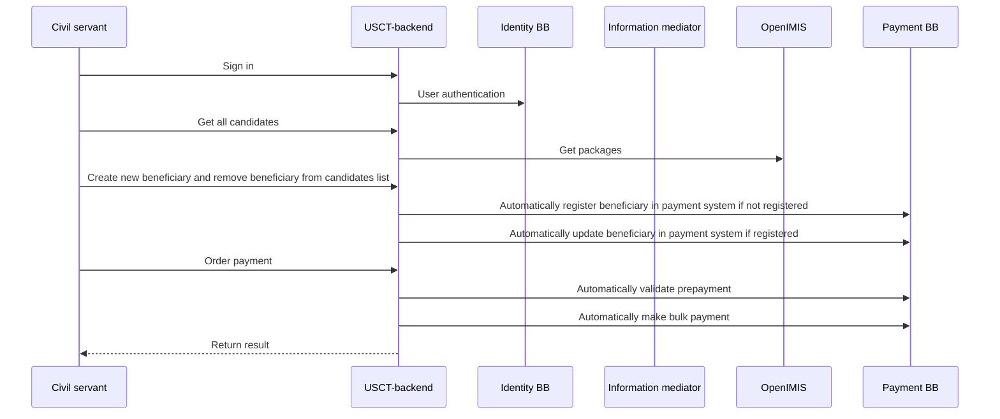
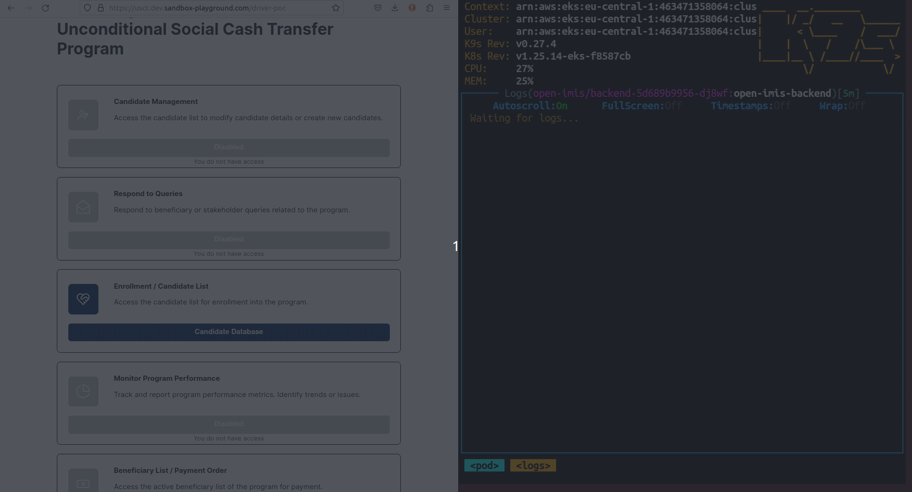

# Unconditional Social Cash Transfer

This is a driver backend application for
[Unconditional Social Cash Transfer](https://github.com/GovStackWorkingGroup/product-use-cases/blob/main/product-use-case/inst-1-unconditional-social-cash-transfer.md)
(USCT) use case.

[Live Demo](https://usct.dev.sandbox-playground.com/driver-poc/)

## Application logic



## Identity BB

[MOSIP e-Signt](https://docs.mosip.io/1.2.0/integrations/e-signet) uses as OpenID Connect.

### Roles and permissions

| FoundationalId | Role               | subject                              | Description                                         |
|----------------|--------------------|--------------------------------------|-----------------------------------------------------|
| 5649650687     | ENROLLMENT_OFFICER | 299950323465436931629862208523254959 | Officer responsible for enrollment                  |
| 4893724702     | PAYMENT_OFFICER    | 294629625538148508290996199782510910 | Officer responsible for payment                     |
| 2371487382     | REGISTRY_OFFICER   | 268505314334796284434550524121540566 | Officer responsible for creating/editing candidates |

Endpoint: `/api/oauth2/authorization/esignet`

## OpenIMIS

OpenIMIS is package provider.
USCT heavily uses packages. To improve performance USCT uses cache for package to avoid redundant requests. 

[Packages](packages.md) pages has more technical details. 

### Adapter
Originaly OpenIMIS base on [Fast Healthcare Interoperability Resources](https://en.wikipedia.org/wiki/Fast_Healthcare_Interoperability_Resources) (FHIR) standard.

The [adapter](https://github.com/openimis/openimis-be-govstack_api_py) provides Govs OpenIMIS specification compliant.

### Example of request




## Payment Building Block

Payments BB is used as payment service that can disburse payment to Beneficiaries which compliant with [specification](https://govstack.gitbook.io/bb-payments/).

Supported payment Building blocks are:

* Payment Building block emulator
  * [API spec](https://govstack.gitbook.io/bb-payments/) version 1.0

  * [Implementation](https://github.com/GovStackWorkingGroup/sandbox-bb-payments/tree/main/emulator/implementation) 
  * [Documentation](https://github.com/GovStackWorkingGroup/sandbox-bb-payments/tree/main/emulator/docs)
* Mifos Payment Hub
  * [API spec](https://govstack.gitbook.io/bb-payments/) version 2.0 (In Development!) 
  * Implementation (in progress)
  * Documentation (in progress)

Environment variable is used to define which service to use:

| Name         | Description                | Applicable values          | Default Value |
|--------------|----------------------------|----------------------------|---------------|
| PAYMENT_MODE | Payment Service to be used | "emulator" or "paymenthub" | "emulator"    |

Environment variables for global configuration:

| Name                  | Description                                               | Applicable values | Default Value |
|-----------------------|-----------------------------------------------------------|-------------------|---------------|
| USCT-BB               | Identifier of the BB that is using the Payment BB         | Any Identifier    | "USCT-BB"     |
| GOVERNMENT_IDENTIFIER | Identifier of the GOVERNMENT that is using the Payment BB | Any Identifier    | "066283"      |


### Payment BB Emulator environment variables
| Name                | Description                                                                                                                                                                                 | Default Value                                                                                  |
|---------------------|---------------------------------------------------------------------------------------------------------------------------------------------------------------------------------------------|------------------------------------------------------------------------------------------------|
| PAYMENT_IM_BASE_URL | URL for accessing Payment BB                                                                                                                                                                | http://sandbox-xroad-ss2.sandbox-im.svc.cluster.local:8080/r1/SANDBOX/GOV/PROVIDER/PAYMENT/api |
| PAYMENT_IM_HEADER   | Header value for Information Mediator Building Block request header "X-Road-Client". More [Information](https://govstack.gitbook.io/bb-information-mediation/v/information-mediation-1.0/). | "PAYMENT_IM_HEADER:SANDBOX/ORG/CLIENT/TEST"                                                    |

### Mifos Payment Hub environment variables 

| Name                               | Description                                                                                                                                                                                 | Default Value                                                                                                                         |
|------------------------------------|---------------------------------------------------------------------------------------------------------------------------------------------------------------------------------------------|---------------------------------------------------------------------------------------------------------------------------------------|
| PAYMENTHUB_ACCOUNT_MAPPER_URL      | URL to account mapper API endpoints                                                                                                                                                         | http://ph-ee-identity-account-mapper.paymenthub.svc.cluster.local:8080                                                                |
| PAYMENTHUB_BULK_CONNECTOR_URL      | URL to Transaction API endpoints                                                                                                                                                            | https://ph-ee-connector-bulk.paymenthub.svc.cluster.local:8443                                                                        |
| PAYMENT_CALLBACK_BASE_URL          | BASE URL for webhooks that will be triggered by Payment BB                                                                                                                                  | http://backend.usct.svc.cluster.local:8080                                                                                            |
| PAYMENT_REGISTERING_INSTITUTION_ID | More information in PaymentHub Documentation ( TBD )                                                                                                                                        | 123456                                                                                                                                |
| PAYMENTHUB_TENANT                  | More information in PaymentHub Documentation ( TBD )                                                                                                                                        | rhino                                                                                                                                 |
| PAYMENTHUB_PROGRAM_ID              | More information in PaymentHub Documentation ( TBD )                                                                                                                                        | 00                                                                                                                                    |
| JWS_TENANT_PRIVATE_KEY             | More information in PaymentHub Documentation ( TBD )                                                                                                                                        | Default private key from [HERE](https://github.com/openMF/ph-ee-connector-common/blob/master/src/main/resources/application-jws.yaml) |
| PAYMENTHUB_PAYMENT_MODE            | More information in PaymentHub Documentation ( TBD )                                                                                                                                        | mojaloop                                                                                                                              |
| PAYMENTHUB_IM_HEADER               | Header value for Information Mediator Building Block request header "X-Road-Client". More [Information](https://govstack.gitbook.io/bb-information-mediation/v/information-mediation-1.0/). | SANDBOX/ORG/CLIENT/TEST                                                                                                               |

## IP FILTER
In order to protect by IP callback endpoints, whitelist of IP can be provided by ENV VAR

| Name          | Description                                | Default Value                     |
|---------------|--------------------------------------------|-----------------------------------|
| CALLBACK_CIDR | Comma separated CIDR-s for whitelisting IP | All IP ranges eg "0.0.0.0/0,::/0" |


## CI/CD

Pipeline variables:

* AWS_RESOURCE_NAME_PREFIX = usct/dev-app
* AWS_CLUSTER_NAME = Kubernetes cluster name, e.g. "Govstack-sandbox-cluster-dev"
* AWS_ACCOUNT = 463471358064 (Sandbox Dev)
* AWS_ROLE = CircleCIRole
* CHART_NAMESPACE = `usct`
* AWS_DEFAULT_REGION = eu-central-1

### Useful commands

```shell
helm install usct ./helm/ --create-namespace --namespace usct
```

```shell
helm upgrade --install usct ./helm/ --create-namespace --namespace usct
```

```shell
helm install --debug --dry-run usct ./helm/ --create-namespace --namespace usct
```

```shell
helm uninstall usct --namespace usct
```

## DB connection

`spring.datasource.url=jdbc:h2:file:./src/main/resources/db/data/usct;AUTO_SERVER=true`

## Password/Secret

https://govstack-global.atlassian.net/wiki/spaces/DEMO/pages/338690049/Passwords
