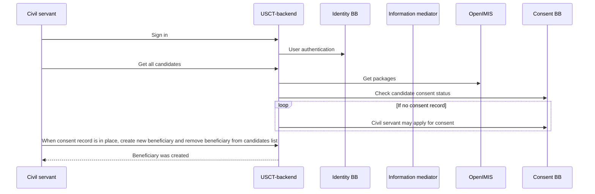
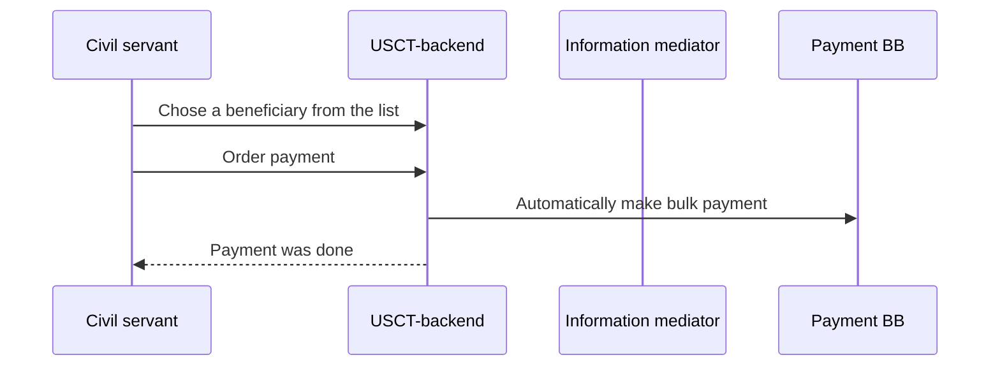

# Unconditional Social Cash Transfer

This is a driver backend application for
[Unconditional Social Cash Transfer](https://github.com/GovStackWorkingGroup/product-use-cases/blob/main/product-use-case/inst-1-unconditional-social-cash-transfer.md)
(USCT) use case.

[Live Demo](https://usct.playground.sandbox-playground.com/driver-poc/)

[Security server №3](https://ss3-im-xroad.playground.sandbox-playground.com)

## Application logic

### Enrollment officer sequence of steps 



### Payment officer sequence of steps



## Authentication / Authorization

Application has configurable authentication logic with cookie-based session management:

* Identity BB _default_
* Stand-alone username/password authentication with hard-coded credentials.

The authentication mode is controlled by the application property `usct.authentication` which can be set by the [service.authmode](../helm/charts/backend/values.yaml) Helm value. 
Available options are **local** and **mosip**.

### Stand-alone authentication

The authentication endpoint `/api/login` uses "form login" and expects the credentials in fields `username` and `password`.
See [Spring Security documentation](https://docs.spring.io/spring-security/reference/servlet/authentication/passwords/index.html) for details.

When using the stand-alone authentication, the password for all users is `password`.

### Identity BB

To trigger the OIDC authentication flow, a client should issue a GET request to `/api/oauth2/authorization/esignet`

* [Identity Building Block documentation](https://govstack.gitbook.io/bb-identity/2-description).
* [MOSIP e-Signet](https://docs.mosip.io/1.2.0/integrations/e-signet) is an implementation of Identity BB based on OpenID Connect.
* [OpenID Connect](https://openid.net/developers/how-connect-works/)

### Roles and permissions

Local authentication uses username/password 
Mosip uses Foundational ID (VID)

| VID / username                  | Role               | Description                                         |
|---------------------------------|--------------------|-----------------------------------------------------|
| 9038952310 / enrollment-officer | ENROLLMENT_OFFICER | Officer responsible for enrollment                  |
| 2405176278 / payment-officer    | PAYMENT_OFFICER    | Officer responsible for payment                     |

## OpenIMIS

OpenIMIS is package provider.
USCT heavily uses packages. To improve performance USCT uses cache for package to avoid redundant requests. 

[Packages](packages.md) pages has more technical details. 

### Adapter
Originaly OpenIMIS base on [Fast Healthcare Interoperability Resources](https://en.wikipedia.org/wiki/Fast_Healthcare_Interoperability_Resources) (FHIR) standard.

The [adapter](https://github.com/openimis/openimis-be-govstack_api_py) provides Govs OpenIMIS specification compliant.

### Example of request


## Consent BB
**GovStack Consent BB API** is an implementation of the building bloc. Details in the [repository](https://github.com/decentralised-dataexchange/bb-consent-api).

## Payment Building Block

Payments BB is used as payment service that can disburse payment to Beneficiaries which compliant with [specification](https://govstack.gitbook.io/bb-payments/).

Supported payment Building blocks are:

* Payment Building block emulator
  * [API spec](https://govstack.gitbook.io/bb-payments/) version 1.0

  * [Implementation](https://github.com/GovStackWorkingGroup/sandbox-bb-payments/tree/main/emulator/implementation) 
  * [Documentation](https://github.com/GovStackWorkingGroup/sandbox-bb-payments/tree/main/emulator/docs)
* Mifos Payment Hub
  * [API spec](https://govstack.gitbook.io/bb-payments/)
  * [Implementation](https://github.com/openMF)
  * [Documentation](https://docs.mifos.org/)

Environment variable is used to define which service to use:

| Name         | Description                | Applicable values          | Default Value |
|--------------|----------------------------|----------------------------|---------------|
| PAYMENT_MODE | Payment Service to be used | "emulator" or "paymenthub" | "emulator"    |

Environment variables for global configuration:

| Name                  | Description                                               | Applicable values | Default Value |
|-----------------------|-----------------------------------------------------------|-------------------|---------------|
| USCT-BB               | Identifier of the BB that is using the Payment BB         | Any Identifier    | "USCT-BB"     |
| GOVERNMENT_IDENTIFIER | Identifier of the GOVERNMENT that is using the Payment BB | Any Identifier    | "066283"      |


### Payment BB Emulator environment variables
| Name                | Description                                                                                                                                                                                 | Default Value                                                                                  |
|---------------------|---------------------------------------------------------------------------------------------------------------------------------------------------------------------------------------------|------------------------------------------------------------------------------------------------|
| PAYMENT_IM_BASE_URL | URL for accessing Payment BB                                                                                                                                                                | http://sandbox-xroad-ss2.sandbox-im.svc.cluster.local:8080/r1/SANDBOX/GOV/PROVIDER/PAYMENT/api |
| PAYMENT_IM_HEADER   | Header value for Information Mediator Building Block request header "X-Road-Client". More [Information](https://govstack.gitbook.io/bb-information-mediation/v/information-mediation-1.0/). | "PAYMENT_IM_HEADER:SANDBOX/ORG/CLIENT/TEST"                                                    |

### Mifos Payment Hub environment variables 

| Name                               | Description                                                                                                                                                                                 | Default Value                                                                                                                         |
|------------------------------------|---------------------------------------------------------------------------------------------------------------------------------------------------------------------------------------------|---------------------------------------------------------------------------------------------------------------------------------------|
| PAYMENTHUB_ACCOUNT_MAPPER_URL      | URL to account mapper API endpoints                                                                                                                                                         | http://ph-ee-identity-account-mapper.paymenthub.svc.cluster.local:8080                                                                |
| PAYMENTHUB_BULK_CONNECTOR_URL      | URL to Transaction API endpoints                                                                                                                                                            | https://ph-ee-connector-bulk.paymenthub.svc.cluster.local:8443                                                                        |
| PAYMENT_CALLBACK_BASE_URL          | BASE URL for webhooks that will be triggered by Payment BB                                                                                                                                  | http://backend.usct.svc.cluster.local:8080                                                                                            |
| PAYMENT_REGISTERING_INSTITUTION_ID | More information in PaymentHub Documentation ( TBD )                                                                                                                                        | 123456                                                                                                                                |
| PAYMENTHUB_TENANT                  | More information in PaymentHub Documentation ( TBD )                                                                                                                                        | rhino                                                                                                                                 |
| PAYMENTHUB_PROGRAM_ID              | More information in PaymentHub Documentation ( TBD )                                                                                                                                        | 00                                                                                                                                    |
| JWS_TENANT_PRIVATE_KEY             | More information in PaymentHub Documentation ( TBD )                                                                                                                                        | Default private key from [HERE](https://github.com/openMF/ph-ee-connector-common/blob/master/src/main/resources/application-jws.yaml) |
| PAYMENTHUB_PAYMENT_MODE            | More information in PaymentHub Documentation ( TBD )                                                                                                                                        | mojaloop                                                                                                                              |
| PAYMENTHUB_IM_HEADER               | Header value for Information Mediator Building Block request header "X-Road-Client". More [Information](https://govstack.gitbook.io/bb-information-mediation/v/information-mediation-1.0/). | SANDBOX/ORG/CLIENT/TEST                                                                                                               |
### Swagger

https://app.swaggerhub.com/apis/myapi943/payment-hub_ap_is/1.0


### Installation

`helm install my-ph-ee-g2psandbox g2p-sandbox-1-5/ph-ee-g2psandbox --version 1.5.0  --create-namespace --namespace paymenthub`

#### Post Deployment Steps
The Post_installation_Job is automated through a Kubernetes job in the helm chart. it will create secrets for ElasticSearch and Kibana. and Upload the BPMN. However, The following steps can be used to create Secrets and upload BPMN Manually.

##### Create the required secrets for Elasticsearch and Kibana

Use https://github.com/openMF/ph-ee-env-labs/tree/master/helm/es-secret and https://github.com/openMF/ph-ee-env-labs/tree/master/helm/kibana-secret you can create a secret for Elasticsearch and Kibana. The command used to create a secret is

1. auth
2. make secrets NAMESPACE=paymenthub

##### Upload BPMN
https://mifos.gitbook.io/docs/payment-hub-ee/overview/installation-instructions/configuration-instructions/deploy-bpmns-with-multiple-dfsp-ids


1. The Payment Hub EE business logic is always driven by the BPMN workflows included in the git repositories. It's not only possible but often necessary to customize these flows to meet the business requirements of a specific environment.

2. Deploying the workflows to the K8S cluster is a separate step, which can be done either manually for each business flow, or using a shell script like this (actual example from the project's CI server):

3. In the below example tenants are picked up from the array declared and for N number of tenants the script will run for N number of times and Internal field separator will convert array into string and store in $t.

4. Zeebe command line tools (the zbctl binary) are also required for deploying the BPMN workflows if Zeebe Operations service is not deployed. This is part of the Zeebe releases and can be downloaded from the Zeebe release page at https://github.com/zeebe-io/zeebe/releases.

5. BPMN deployment should be done with corresponding release version which can be obtained from release notes

6. In the below script HOST should be replaced with the zeebe ops(port-forwarded) url from your cluster.

```bash
#!/bin/bash
HOST="http://localhost:5000/zeebe/upload"

deploy(){
cmd="curl --insecure --location --request POST $HOST \
--header 'Platform-TenantId: $2' \
--form 'file=@\"$PWD/$1\"'"
echo "$cmd"
eval "$cmd"
}

TENANTS="gorilla,lion,rhino"
IFS=',' read -ra TENANT_ARRAY <<< "$TENANTS"

for t in "${TENANT_ARRAY[@]}"; do
LOC="feel/*.bpmn"
for f in $LOC; do
# Check if "DFSPID" is present in the filename
if echo "$f" | grep -q "DFSPID"; then
# Replace "DFSPID" with the current tenant value in the filename
new_file_name=$(echo "$f" | sed "s/DFSPID/$t/")
else
# If "DFSPID" is not present, use the original name
new_file_name="$f"
fi
deploy "$new_file_name" "$t"
done

    LOC2="feel/example/*.bpmn"
    for f in $LOC2; do
        # Check if "DFSPID" is present in the filename
        if echo "$f" | grep -q "DFSPID"; then
            # Replace "DFSPID" with the current tenant value in the filename
            new_file_name=$(echo "$f" | sed "s/DFSPID/$t/")
        else
            # If "DFSPID" is not present, use the original name
            new_file_name="$f"
        fi
        deploy "$new_file_name" "$t"
    done
done
```


#### Change port for bulk connector from 8443 to 8080 and turn off TLS

**Use it only for demo purpose**


Update config of **ph-ee-connector-bulk** pod

```yaml
- name: SECURITY_JWS_ENABLE
  value: "false"
- name: SERVER_PORT
  value: "8080"
- name: SERVER_SSL_ENABLED
  value: "false"

```

#### Transaction request example:

```bash
curl --location 'https://localhost:8443/batchtransactions?type=raw' \
--header 'X-CallbackURL: https://webhook.site/{webhook}' \
--header 'X-Registering-Institution-ID: 123' \
--header 'Purpose: test payment' \
--header 'X-CorrelationID: 123' \
--header 'Platform-TenantId: gorilla' \
--header 'X-Program-ID: 00' \
--header 'Type: raw' \
--header 'Content-Type: application/json' \
--data ' {
        "requestId":"8238482323",
        "creditParty": [
            {
                "key": "msisdn",
                "value": "8837461856"
            }
        ],
        "paymentMode ": "closedLoop",
        "amount": "20.00",
        "currency": "SGD",
        "descriptionText": "Test Payment"
    }'
```

#### Get transactions

http://ph-ee-operations-app:5000/api/v1/batches?page=0&size=10&sortOrder=asc&orderBy=requestFile&Platform-TenantId=gorilla

## IP FILTER
In order to protect by IP callback endpoints, whitelist of IP can be provided by ENV VAR

| Name          | Description                                | Default Value                     |
|---------------|--------------------------------------------|-----------------------------------|
| CALLBACK_CIDR | Comma separated CIDR-s for whitelisting IP | All IP ranges eg "0.0.0.0/0,::/0" |


## CI/CD

Pipeline variables:

* AWS_RESOURCE_NAME_PREFIX = usct/dev-app
* AWS_CLUSTER_NAME = Kubernetes cluster name, e.g. "Govstack-sandbox-cluster-dev"
* AWS_ACCOUNT = 463471358064 (Sandbox Dev)
* AWS_ROLE = CircleCIRole
* CHART_NAMESPACE = `usct`
* AWS_DEFAULT_REGION = eu-central-1
* OIDC_KEYSTORE_PASSWORD = [link](main.md#passwordsecret)
* CONSENT_TOKEN = [link](main.md#passwordsecret)
* DATA_AGREEMENT_ID = [link](main.md#passwordsecret)

### Useful commands

```shell
helm install usct-backend ./helm/ --create-namespace --namespace usct
```

```shell
helm upgrade --install usct-backend ./helm/ --create-namespace --namespace usct
```

```shell
helm install --debug --dry-run usct-backend ./helm/ --create-namespace --namespace usct
```

```shell
helm uninstall usct-backend --namespace usct
```

## DB connection

`spring.datasource.url=jdbc:h2:file:./src/main/resources/db/data/usct;AUTO_SERVER=true`

## Password/Secret

In line with best practices, storing passwords in Git is discouraged.

Some passwords or secrets can be found in [Confluence](https://govstack-global.atlassian.net/wiki/spaces/DEMO/pages/338690049/Passwords).

Please generate your own passwords or secrets, or reach out to the building block vendor for assistance.